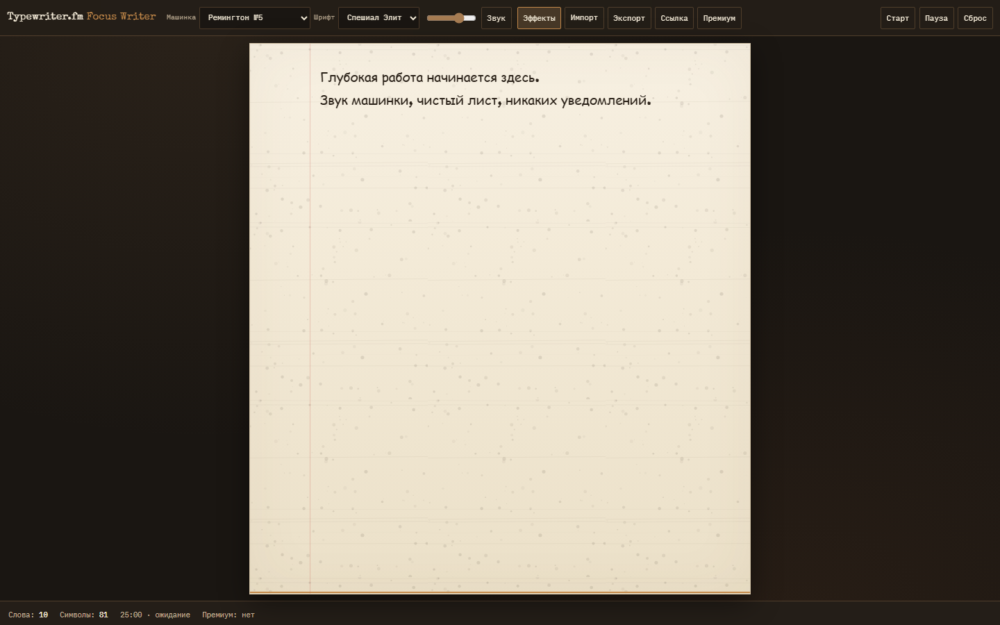
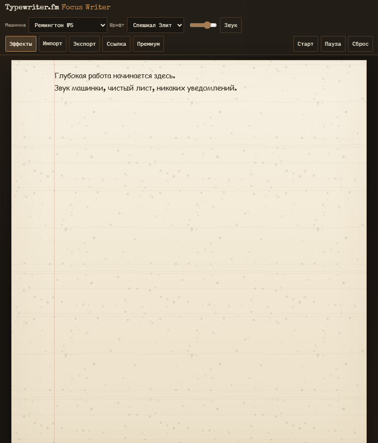
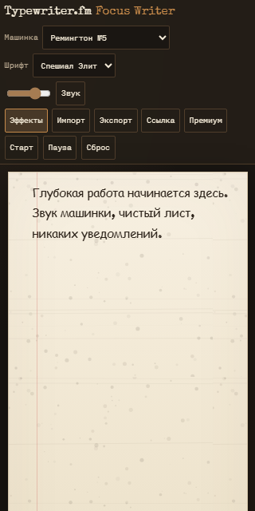

# Typewriter.fm Focus Writer

Минималистичный полноэкранный редактор для глубокой работы. Реалистичный звук печатной машинки, аналоговые шрифты, лёгкое дрожание букв и «грязные» чернила — ASMR-писательство без отвлечений.


## Возможности

- Чистое поле ввода на весь экран (бумага на тёмном столе)
- Библиотека машинок: Ремингтон, Андервуд, Гермес + премиум Оливетти и Адлер
- Динамическая громкость по скорости печати
- Звук пробела, перевода строки (рычаг), «дыхание» каретки при простое
- Анимация заправки бумаги при открытии
- Счётчик слов/символов (Web Worker)
- Таймер помодоро
- Импорт/экспорт `.txt` / `.md`, вставка ссылок с валидацией
- Премиум-подписка **2 $/мес** — только локально (без бэкенда)

## Скриншоты

| Рабочий стол (1440px) | Планшет (768px) | Телефон (320px) |
| --- | --- | --- |
|  |  |  |

### Демо-анимация заправки бумаги


## Быстрый старт

```bash
npm install
npm run dev
```

Откройте **только** адрес Vite: `http://127.0.0.1:8765`

Не открывайте `index.html` двойным щелчком и не через Live Server — будет ошибка `main.ts 404`. Нужен именно `npm run dev`.

Онлайн: https://abudkina.github.io/typewriter-fm-focus-writer/

Сборка локально:

```bash
npm run build
npm run preview
```

## Тесты

```bash
npm test          # unit (Vitest) — 34 теста
npm run test:e2e  # e2e (Playwright)
npm run test:all  # unit + e2e
```

Перед первым e2e:

```bash
npx playwright install chromium
```

## Стек

- Vite + TypeScript
- Howler.js + Web Audio API (процедурные WAV)
- LocalStorage + IndexedDB
- Web Worker (статистика текста)
- OffscreenCanvas (текстура чернил)
- Vitest + Playwright

Бэкенда нет: ключи, пароли и `.env` не требуются.

## Структура

```
src/
  app/App.ts              # UI и сценарии
  modules/audio/          # звук, динамика печати, синтез
  modules/pomodoro/       # таймер
  modules/premium/        # локальная подписка
  modules/storage/        # LocalStorage / IndexedDB
  modules/stats/          # клиент воркера
  modules/effects/        # визуальные эффекты
  workers/stats.worker.ts
  data/typewriters.json
  utils/                  # logger, валидация, ошибки
tests/unit/               # бизнес-логика
tests/e2e/                # пользовательские сценарии
```

## Премиум

Кнопка **Премиум** активирует Оливетти и Адлер на этом устройстве. Реальных платежей нет — всё хранится в `localStorage`.

## Доступность

- Семантическая разметка, `aria-label` на кнопках
- Фокус-стили, контрастная бумага на тёмном фоне
- `lang="ru"`, интерфейс полностью на русском
- `prefers-reduced-motion` отключает анимации

## Lighthouse (production `vite preview`)

| Категория | Desktop | Mobile |
| --- | --- | --- |
| Performance | 100 | 99 |
| Accessibility | 100 | 100 |
| Best Practices | 100 | 100 |

## Лицензия

MIT
